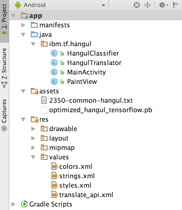

# TensorFlow와 Android로 한글 손글씨 인식하기

*다른 언어로 보기: [English](README.md).*

한국어를 표현하는 한글은 19개의 자음과 21개의 모음 문자를 가지고 있습니다. 이 문자들을 조합하면 최대 11,172개의 음절과 글자들을 표현할 수 있지만 그 중 일부만이 주로 사용됩니다.

이 과정은 한국어 음절을 인식하는 TensorFlow 모델을 활용하는 Android 앱을 만드는 것을 다루게 됩니다.
이 앱에서 사용자는 한국어 음절을 모바일 단말에 그릴 수 있게 되며, 앱은 훈련된 모델을 이용하여 어떤 글자인지를 추측하게 됩니다. 더 나아가, 앱에서 한글 단어 또는 문장을 작성한 다음 [Watson Language Translator](https://www.ibm.com/watson/services/language-translator/) 서비스를 사용하여 번역할 수 있습니다.


다음과 같은 단계가 다루어집니다:
1. 온라인에서 얻은 한글 지원 글꼴을 이용하여 이미지 데이터를 생성하고 탄성 변형을 진행합니다.
2. 입력과 모델 훈련에 사용되도록 이미지를 TFRecord 형식으로 변환합니다.
3. 모델을 훈련하고 저장합니다.
4. Android 앱에 저장된 모델을 사용합니다.
5. 번역을 위해 Watson Language Translator 서비스에 접속합니다.


## 순서


1. 데이터 생성에 필요한 몇 몇의 한글 글꼴을 다운로드 받습니다.
2. 글꼴로 부터 생성된 이미지들을 TensorFlow 모델에 입력하여 훈련합니다.
3. Android 단말에서 한글 문자를 그립니다.
4. 그려진 문자는 이전에 훈련되었던 TensorFlow 모델과 Android TensorFlow Inference 인터페이스를 사용하여 인식됩니다.
5. 한글로 분류된 문자열은 Watson Language Translator 서비스로 전달되어 영문으로 번역됩니다.


## Watson과 함께

여러분의 Watson 앱을 다음 단계로 진행하고 싶으십니까? Watson 브랜드 자신을 활용할 방법을 찾고 계신가요? [With Watson](https://www.ibm.com/watson/with-watson) 프로그램에 가입하세요. 여러분의 Watson 내장 상용 솔루션을 확대하고 가속할 수 있는 독점적인 브랜드, 마케팅 그리고 기술 자료를 제공합니다.


## 포함된 구성 요소

* [Watson Language Translator](https://www.ibm.com/watson/services/language-translator/): 특정 분야에 대한 배경을 모델로 이용하여 특정 언어의 문자열을 입력받아 다른 언어로 변환하는 최종 사용자용 IBM Cloud 서비스.
* [TensorFlow](https://www.tensorflow.org/): 기계 지능을 위한 오픈소스 소프트웨어 라이브러리.
* [Android](https://developer.android.com/develop/index.html): Linux 커널을 기반으로 한 오픈 소스 모바일 운영 체제.


## 주요 기술

* [인공 지능](https://developer.ibm.com/code/technologies/artificial-intelligence): 인간처럼 이해, 추론, 학습, 상호작용이 가능한 인지 기술.
* [모바일](https://developer.ibm.com/code/technologies/mobile): 모바일 사용자를 위해 특별히 디자인된 애플리케이션을 개발하고 참여를 가능하게 하는 환경.


## 동영상

[](https://www.youtube.com/watch?v=iefYaCOz00s)


## 단계

이 개발자 과정을 구성하고 실행하기 위해 아래 단계를 따르십시오. 이 단계들은 아래쪽에 상세하게 기술되어 있습니다.

1. [사전 준비 사항 설치하기](#1-사전-준비-사항-설치하기)
2. [이미지 자료 생성하기](#2-이미지-자료-생성하기)
3. [이미지를 TFRecords로 변환하기](#3-이미지를-tfrecords로-변환하기)
4. [모델 훈련시키기](#4-모델-훈련시키기)
5. [모델 시도해보기](#5-모델-시도해보기)
6. [Android 앱 작성하기](#6-android-앱-작성하기)


### 1. 사전 준비 사항 설치하기

여러분의 시스템에 이 과정을 위한 python 요구사항이 설치되어 있어 합니다. 저장소의 최상위 디렉토리에서 다음을 실행하십시오:

```
pip install -r requirements.txt
```

**참고:** Windows 사용자인 경우, _scipy_ 패키지가 **pip** 를 통해 설치되지 않습니다. _scipy_ 사용을 위해
[scientific Python distribution](https://www.scipy.org/install.html#scientific-python-distributions) 설치를 추천합니다.
좀 더 유명한 것 중 하나는 [Anaconda](https://www.anaconda.com/download/)입니다.
그러나, Windows에서는 [여기](http://www.lfd.uci.edu/%7Egohlke/pythonlibs/#scipy)에 있는 인스톨러를 사용하여 수동으로 _scipy_ 패키지를 설치할 수 있습니다.

### 2. 이미지 자료 생성하기

어느정도 괜찮은 모델로 훈련하기 위해서는 일정량의 데이터가 필요합니다.
그러나, 실제 한글 손글씨에 대한 자료를 충분하게 모을 수 있을 정도로 찾는 것이 쉽지 않으며 이를 만들기도 귀찮은 일입니다.

이런 이슈를 해결하는 방법으로 프로그램으로 여러분 스스로 데이터를 생성하는 것이 있습니다. 한글 글꼴 파일을 온라인에서 많이 찾을 수 있는다는 장점을 활용합니다. 그러므로, 이제부터 이에 대해 진행합니다.

이 저장소의 tools 디렉토리에는 [hangul-image-generator.py](./tools/hangul-image-generator.py)가 있습니다.
이 스크립트는 라벨 파일로 주어지는 각각의 문자에 대한 이미지를 생성하기 위해 fonts 디렉토리에 있는 글꼴들을 사용합니다. 기본 라벨 파일은 [2350-common-hangul.txt](./labels/2350-common-hangul.txt)로 [KS X 1001 encoding](https://en.wikipedia.org/wiki/KS_X_1001)에서 가지고 온 주요 사용 글자 2350자를 포함하고 있습니다. 다른 라벨 파일들은 [256-common-hangul.txt](./labels/256-common-hangul.txt) 와
[512-common-hangul.txt](./labels/512-common-hangul.txt)이 있습니다.
이 파일들은 국립국어원에 의해 편집된 기본 어휘 6000단어 목록([여기](https://www.topikguide.com/download/6000_korean_words.htm))에서 가져왔습니다.
훈련용 컴퓨터 머신이 고성능이 아닌 경우, 좀 더 적은양의 라벨 세트를 사용하는 것이 나중에 전체 모델의 훈련 시간을 줄이는 데 도움이 될 수 있습니다.

[fonts](./fonts) 폴더는 현재는 비어있는데, 한글 데이터 세트를 생성하기 전에 fonts 디렉토리에 있는 [README](./fonts/README-ko.md)에 설명해 놓은 글꼴 파일을 반드시 먼저 다운로드 해 놓아야 합니다.
제가 사용한 데이터 세트는 대략 40가지의 글꼴 파일을 사용하였지만 여러분의 데이터 세트를 더 좋게 만들고 싶다면 더 많은 파일을 사용할 수 있습니다. 특히 몇몇 독특한 스타일을 갖고 있다면 더욱 그렇습니다.
fonts 디렉토리가 채워지면, [hangul-image-generator.py](./tools/hangul-image-generator.py)로 실제 이미지 생성 단계를 진행할 수 있습니다.

이를 위한 선택 사항 플래그는 다음과 같습니다:

* `--label-file`: 다른 라벨 파일을 지정합니다. (보통 글자 수가 적은 것).
  기본 값은 _./labels/2350-common-hangul.txt_ 입니다.
* `--font-dir`: 다른 글꼴 디렉토리를 지정합니다. 기본 값은 _./fonts_ 입니다.
* `--output-dir`: 생성되는 이미지가 저장되는 디렉토리를 지정합니다.
  기본 값은 _./image-data_ 입니다.

이제 이를 실행하여, 골라 놓은 라벨 파일을 지정합니다:

```
python ./tools/hangul-image-generator.py --label-file <your label file path>
```

얼마나 많은 라벨과 글꼴이 있는지에 따라 이 스크립트를 완료하기까지 걸리는 시간이 달라집니다. 데이터 세트 보강을 위해, 세 가지의 임의 탄성 변형이 각 생성된 문자 이미지에 대해 수행됩니다. 이미지 예제는 아래와 같이 보여지며, 제일 먼저 보여지는 것이 원본 문자이며, 그 다음이 탄성 변형된 글자들입니다.


이 스크립트가 완료되면, 결과물 디렉토리에 모두 64x64 JPEG 이미지를 담고 있는 _hangul-images_ 폴더가 생성됩니다. 또한, 결과물 디렉토리에는 라벨에 대응하는 모든 이미지 경로를 매핑하는 _labels-map.csv_ 파일도 생성됩니다.


### 3. 이미지를 TFRecords로 변환하기

TensorFlow의 표준 입력 형식은 [TFRecords](https://www.tensorflow.org/api_guides/python/python_io#tfrecords_format_details)로서 원본 이미지 데이터와 라벨을 한 곳에 저장하기 위해 사용할 수 있는 바이너리입니다. TensorFlow 모델에 양질의 데이터를 주기 위해 이미지들로 부터 TFRecords 파일을 먼저 생성합니다. 제공된 [스크립트](./tools/convert-to-tfrecords.py)는 이와 같은 동작을 수행합니다.

이 스크립트는 먼저 앞서 생성했던 _labels-map.csv_ 파일을 기반으로 모든 이미지와 라벨 데이터를 읽어 들입니다. 그러고 나서, 데이터를 나누어 테스트용 세트와 훈련용 세트(15% 테스트용, 85% 훈련용)를 얻게 됩니다.
기본적으로, 테스트용 세트는 여러 개(세 개)의 파일/샤드(shard)에 저장되므로 파일이 거대화 되지는 않습니다. 그러나, CLI 옵션 _--num-shards-train_ 을 이용하면 데이터 세트 크기에 따라 이를 조정할 수 있습니다.

이 스크립트를 위한 옵션 플래그는 다음과 같습니다:

* `--image-label-csv` 이미지 경로와 라벨을 연결하는 CSV 파일을 지정합니다.
  기본 값은 _./image-data/labels-map.csv_ 입니다.
* `--label-file` 훈련용 세트에 대응하는 라벨을 지정합니다.
  이는 스크립트로 여러 개의 클래스를 탐지 하기 위해 사용됩니다.
  기본 값은 _./labels/2350-common-hangul.txt_ 입니다.
* `--output-dir` TFRecords 파일 저장을 위한 결과물 디렉토리를 지정합니다.
  기본 값은 _./tfrecords-output_ 입니다.
* `--num-shards-train` 훈련용 세트 TFRecords를 나누는 샤드의 숫자를 지정합니다. 기본 값은 _3_ 입니다.
* `--num-shards-test` 테스트용 세트 TFRecords를 나누는 샤드의 숫자를 지정합니다. 기본 값은 _1_ 입니다.

이 스크립트를 실행하기 위해, 단순하기 아래와 같이 실행할 수 있습니다:

```
python ./tools/convert-to-tfrecords.py --label-file <your label file path>
```

이 스크립트가 실행되어 완료되면, 결과물 디렉토리 _./tfrecords-output_ 에서 샤드된 TFRecords 파일들을 얻게 됩니다.

```
$ ls ./tfrecords-output
test1.tfrecords    train1.tfrecords    train2.tfrecords    train3.tfrecords
```

### 4. 모델 훈련시키기

이제 충분한 데이터를 가지게 되었으니 이를 실제 사용해 볼 시간입니다. 이 프로젝트의 최상위 디렉토리에는 [hangul_model.py](./hangul_model.py) 파일이 있습니다. 이 스크립트는 TFRecords 파일을 읽기 위한 입력 파이프라인 생성과 이미지 및 라벨에 대한 무작위 일괄처리 데이터 생산을 담당합니다. 그다음, 컨볼루션 신경망(CNN)이 정의되고 훈련이 시작됩니다. 이 훈련 단계는 이미지 및 라벨의 일괄처리 데이터를 CNN에 지속적으로 공급하여 각각의 글자들을 올바르게 구별할 수 있는 최적의 가중치와 편향치를 찾습니다. 훈련이 끝나면, 모델은 Android 앱에서 사용될 수 있도록 내보내어집니다.

여기 이 모델은 TensorFlow [웹사이트](https://www.tensorflow.org/get_started/mnist/pros)에서 설명하는 MNIST 모델과 비슷합니다. 더 많아진 클래스들을 구분하는 것을 도와주는 특징(features)들을 더 추출하도록 3차 컨볼루션 레이어가 추가되었습니다.

이 스크립트를 위한 옵션 플래그는 다음과 같습니다:

* `--label-file` 훈련용 세트에 대한 라벨 파일을 지정합니다.
  스크립트에서 구별을 위한 클래스들의 갯수를 확인하는데 사용됩니다.
  기본 값은 _./labels/2350-common-hangul.txt_ 입니다.
* `--tfrecords-dir` TFRecords 샤드를 담게되는 디렉토리를 지정합니다.
  기본 값은 _./tfrecords-output_ 입니다.
* `--output-dir` 모델 checkpoint, graph 그리고 프로토콜 버퍼 파일 저장을 위한 디렉토리를 지정합니다. 기본 값은 _./saved-model_ 입니다.
* `--num-train-steps` 수행할 훈련 단계의 갯수를 지정합니다.
  이는 데이터가 많아질 수록 증가해야 합니다(반대의 경우도 마찬가지). 단계의 갯수는 전체 훈련 데이터 (세대, epoch)에 걸쳐 몇 번정도 반복 될 수 있도록 해야 합니다.
  예를 들어 훈련용 세트에 320,000 개의 이미지를 가지고 있는 경우라면 하나의 세대(epoch)는 기본 일괄처리 데이터 크기인 _100_ 을 기준으로 _320000/100 = 3200_ 단계가 됩니다. 그러므로, 만약 30세대 정도 훈련한다면, 단순하게 _3200*30 = 96000_ 의 훈련 단계를 수행하면 됩니다.
  적어도 15세대만큼은 실행될 수 있도록 이 옵션 값을 확실하게 조절하십시오.
  기본 값은 _30000_ 단계입니다.

이 훈련을 실행하려면, 이 프로젝트의 최상위 디렉토리에서 다음과 같이 실행하십시오:

```
python ./hangul_model.py --label-file <your label file path> --num-train-steps <num>
```

이미지를 얼마나 많이 가지고 있는지에 따라, 훈련에 걸리는 시간이 길어집니다 (몇 시간에서 하루가 걸리기도 합니다). 특히 랩톱 컴퓨터의 경우에 더 그렇습니다.
GPU에 접근할 수 있는 경우 속도 향상에 도움이 됩니다. 그 경우에는 GPU가 지원되는 TensorFlow 버젼을 설치해야 합니다. ([Ubuntu](https://www.tensorflow.org/install/install_linux)와
[Windows](https://www.tensorflow.org/install/install_windows)만 지원 가능합니다).

Nvidia GTX 1080 그래픽카드를 가진 Windows 데크크톱 컴퓨터에서 320,000 개의 이미지를 스크립트 기본 값으로 훈련하는데 대략 2시간 정도가 소요되었습니다.
MacBook Pro에서 훈련시키면 대략 20배 이상 더 오래 걸릴 것 같습니다.

한 가지 대안으로 연산 복잡도를 상당량 낮출 수 있는 라벨 세트(예를 들어 256자 vs 2350자)를 사용하는 방법이 있습니다.
스크립트가 실행됨에 따라, 훈련 정확도가 1.0을 향해 증가하는 것과 훈련을 마쳤을 때 예상되는 검사 정확도가 출력되는 것을 볼 수 있습니다. 스크립트가 완료되면 모델이 만들어져 내보내어진 것을 볼 수 있습니다. 기본적으로  `./saved-model/optimized_hangul_tensorflow.pb` 파일에 저장됩니다. 이것은 [프로토콜 버퍼](https://en.wikipedia.org/wiki/Protocol_Buffers) 파일로서  훈련된 모든 가중치와 편향치를 가지고 있는 모델의 직렬화된 버젼을 나타냅니다. 이 특정한 형식은 추론 전용 용도에 최적화되어 있습니다.

### 5. 모델 시도해보기

새로 저장된 모델로 Android 앱을 만들어보기 전에, 먼저 이를 사용해 보도록 합니다. 제공된 [스크립트](./tools/classify-hangul.py)는 모델을 로딩하고 주어진 이미지를 추측하는데 사용합니다. 가지고 있는 이미지나 아래 예제 이미지를 다운로드하여 사용해 보십시오. 단, 각각의 이미지가 64x64의 검은 배경에 하얀색으로 된 글자이어야 합니다.

이 스크립트를 위한 옵션 플래그는 다음과 같습니다:

* `--label-file` 다른 라벨 파일을 지정합니다. 이 파일은 one-hot 방식으로 나타낸 라벨의 인덱스를 실제 글자로 연결하는데 사용됩니다.
  기본 값은 _./labels/2350-common-hangul.txt_.
* `--graph-file` 저장된 모델 파일을 지정합니다.
  기본 값은 _./saved-model/optimized_hangul_tensorflow.pb_.

아래와 같은 형태로 실행하십시오:

```
python ./tools/classify-hangul.py <Image Path> --label-file <your label file path>
```

***예제 이미지:***


이 스크립트를 실행하고 나면, 다섯 개의 예측 값과 그에 대응하는 점수 값을 볼 수 있습니다. 가장 높은 예측 값이 실제 입력한 글자와 맞기를 바랍니다.

**참고**: 만약 이 스크립트가 Windows에서 실행된다면, 한글이 콘솔에서 잘 표시 될 수 있도록 UTF-8를 지원하는 활성 코드 페이지로 변경해야 합니다. 간단히 다음과 같이 실행하십시오:

```
chcp 65001
```

그 다음, 콘솔 글꼴을 한글이 지원되는 것(바탕, 돋움 또는 굴림) 중 하나를 선택합니다.


### 6. Android 앱 작성하기

저장된 모델을 가지고, 사용자가 그린 한글 손글씨를 구별할 수 있는 간단한 Android 앱을 만들어 낼 수 있습니다. 완성된 앱이 [./hangul-tensordroid](./hangul-tensordroid)에 이미 들어 있습니다.

#### 프로젝트 구성하기

여러분 스스로 앱을 사용해보는 가장 쉬운 방법은 [Android Studio](https://developer.android.com/studio/index.html)를 사용하는 것입니다. 이는 IDE내에서 수 많은 Android 의존 정보를 처리합니다.

Android Studio를 다운로드하고 설치한 후 다음 단계를 수행하십시오:

1) Android Studio를 실행합니다
2) **Welcome to Android Studio** 윈도가 나타나면, 여기에서
  **Open an existing Android Studio project**를 선택합니다. 이 윈도가 나타나지 않는다면, 상단 메뉴에서 **File > Open...** 을 선택합니다.
3) 파일 탐색기에서 프로젝트의 _./hangul-tensordroid_ 디렉토리로 이동한 후 **OK** 를 클릭합니다.

빌드와 초기화가 되면, 프로젝트는 Android Studio에서 사용할 수 있는 상태가 됩니다. Gradle이 프로젝트를 첫 번째 빌드할 때, 몇몇의 의존성 이슈가 있는 것을 볼 수 있습니만 이는 Android Studio의 에러에 표시된 링크를 클릭하여 종속성을 설치하는 것으로 쉽게 해결할 수 있습니다.

Android Studio의 사이드 메뉴에서 프로젝트의 구조를 쉽게 확인할 수 있습니다.



java 폴더는 앱을 위한 모든 java 소스 코드를 담고 있습니다. 이를 펼쳐보면 네 개의 java 파일을 보여줍니다:

1) **[MainActivity.java](./hangul-tensordroid/app/src/main/java/ibm/tf/hangul/MainActivity.java)**
   앱의 main이 시작하는 곳이며 설정 및 버튼 처리 로직을 담당합니다.
2) **[PaintView.java](./hangul-tensordroid/app/src/main/java/ibm/tf/hangul/PaintView.java)**
   사용자가 화면의 BitMap에 한글을 그릴 수 있도록 하는 클래스입니다.
3) **[HangulClassifier.java](./hangul-tensordroid/app/src/main/java/ibm/tf/hangul/HangulClassifier.java)**
   사전 훈련된 모델을 로딩하고 구별할 이미지를 전달하는데 사용되는TensorFlow Inference 인터페이스로 연결합니다.
4) **[HangulTranslator.java](./hangul-tensordroid/app/src/main/java/ibm/tf/hangul/HangulTranslator.java)**
   Watson Language Translator API에 대한 인터페이스로서 한글을 영문로 변환하는데 사용됩니다.

현재 상태의 Android 앱은 _2350-common-hangul.txt_ 라벨 파일을 사용하며 40개의 글꼴에서 얻어진 320,000 개의 이미지를 사용하여 훈련된 모델을 포함하고 있습니다. 이는 프로젝트의 _assets_ 폴더(_./hangul-tensordroid/app/src/main/assets/_)에 저장되어 있습니다.
만약 모델이나 라벨 파일을 바꾸는 경우라면 단순히 이 디렉토리에 가져다 놓으면 됩니다.
그리고, [MainActivity.java](./hangul-tensordroid/app/src/main/java/ibm/tf/hangul/MainActivity.java)(_./hangul-tensordroid/app/src/main/java/ibm/tf/hangul/MainActivity.java_) 파일의 윗쪽에 있는 `LABEL_FILE` 와 `MODEL_FILE` 상수에 해당 파일에 대한 이름을 지정해 주어야 합니다.

만약 번역 기능을 사용하려면 다음과 같이 해야 합니다:

1) [여기](https://cloud.ibm.com/registration/)에서 IBM Cloud 계정을 생성합니다.
2) [Watson Language Translator](https://cloud.ibm.com/catalog/services/language-translator) 서비스를 생성합니다.
3) Translator 서비스의 신임 정보를 얻습니다. 신임 정보는 자동으로 생성됩니다. 이 정보는 IBM Cloud 대시보드의 **서비스** 영역 아래 있는 **Language Translator** 서비스를 클릭해서 얻을 수 있습니다.
4) _[./hangul-tensordroid/app/src/main/res/values/translate_api.xml](./hangul-tensordroid/app/src/main/res/values/translate_api.xml)_
   의 **username** 과 **password** 값을 3단계에서 얻은 값으로 변경합니다.

#### 앱 실행하기

앱을 빌드하고 실행할 준비가 되었다면 Android Studio 상단의 초록색 화살표 버튼을 클릭합니다.


이 때 **Select Deployment Target** 이라는 윈도를 보게됩니다. 만약 실제 Android 단말을 가지고 있다면 부담없이 USB 케이블을 이용하여 컴퓨터에 연결할 수 있습니다. 자세한 정보는 [여기](https://developer.android.com/studio/run/device.html)를 참고 하시기 바랍니다. Android 단말이 없다면 대안으로 에뮬레이터를 이용할 수 있습니다. **Select Deployment Target** 윈도에서 **Create New Virtual Device** 를 클릭합니다. 그러고 나서, 단말 정의와 이미지(API 레벨 21 이상의 이미지를 선호)를 선택합니다. 가상 단말이 생성되고 나면 앱을 실행할 대상으로 이를 선택할 수 있습니다.

단말을 골랐다면 앱은 자동으로 빌드되고 단말에 설치 및 실행됩니다.

모델이 여러분의 한글 손글씨를 잘 인식하는지 앱에서 그려보십시오.


## 링크

* [전문가를 위한 Deep MNIST](https://www.tensorflow.org/get_started/mnist/pros): 필기 인식 숫자 인식을 위한 컨볼루션 신경망 생성 및 학습 튜토리얼 (영문).
* [TensorFlow 모바일](https://www.tensorflow.org/mobile/): 다른 플랫폼들에서의 TensorFlow 모바일에 대한 지원 정보 (영문).
* [한글 음절](https://en.wikipedia.org/wiki/Hangul_Syllables): 모든 한글 음절 목록(영문).


## 라이센스

[Apache 2.0](LICENSE)
