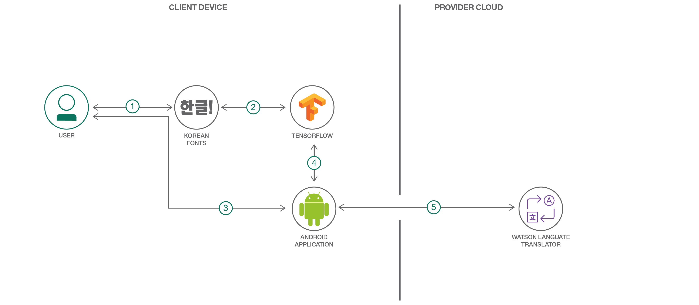

# Handwritten Korean Character Recognition with TensorFlow and Android

*Read this in other languages: [한국어](README-ko.md),[日本語](README-ja.md).*

Hangul, the Korean alphabet, has 19 consonant and 21 vowel letters.
Combinations of these letters give a total of 11,172 possible Hangul
syllables/characters. However, only a small subset of these are typically used.

This code pattern will cover the creation process of an Android application that
will utilize a TensorFlow model trained to recognize Korean syllables.
In this application, users will be able to draw a Korean syllable on their
mobile device, and the application will attempt to infer what the character is by
using the trained model. Furthermore, users will be able to form words or sentences
in the application which they can then translate using the
[Watson Language Translator](https://www.ibm.com/watson/services/language-translator/)
service.


The following steps will be covered:
1. Generating image data using free Hangul-supported fonts found online and
   elastic distortion.
2. Converting images to TFRecords format to be used for input and training of
   the model.
3. Training and saving the model.
4. Using the saved model in a simple Android application.
5. Connecting the Watson Language Translator service to translate the characters.



## Flow

1. The user downloads several Korean fonts to use for data generation.
2. The images generated from the fonts are fed into a TensorFlow model for training.
3. The user draws a Korean character on their Android device.
4. The drawn character is recognized using the previously trained TensorFlow model and the
   Android TensorFlow Inference Interface.
5. A string of the classified Korean characters is sent to the Watson Language Translator
   service to retrieve an English translation.

## Included Components

* [Watson Language Translator](https://www.ibm.com/watson/services/language-translator/):
An IBM Cloud service that converts text input in one language into a destination language
for the end user using background from domain-specific models.
* [TensorFlow](https://www.tensorflow.org/): An open-source software library for
Machine Intelligence.
* [Android](https://developer.android.com/docs/): An open-source mobile
operating system based on the Linux kernel.

## Featured Technologies

* [Artificial Intelligence](https://developer.ibm.com/technologies/artificial-intelligence/):
  Cognitive technologies that can understand, reason, learn, and interact like
  humans.
* [Mobile](https://developer.ibm.com/technologies/mobile/): An environment to
  develop apps and enable engagements that are designed specifically for mobile
  users.

# Watch the Video

[](https://www.youtube.com/watch?v=iefYaCOz00s)

# Steps

## Run locally

Follow these steps to setup and run this code pattern. The steps are
described in detail below.

1. [Clone the repo](#1-clone-the-repo)
2. [Install dependencies](#2-install-dependencies)
3. [Generate Image Data](#3-generate-image-data)
4. [Convert Images to TFRecords](#4-convert-images-to-tfrecords)
5. [Train the Model](#5-train-the-model)
6. [Try Out the Model](#6-try-out-the-model)
7. [Create the Android Application](#7-create-the-android-application)

### 1. Clone the repo

Clone the `tensorflow-hangul-recognition` locally. In a terminal, run:

```
git clone https://github.com/IBM/tensorflow-hangul-recognition
```

Now go to the cloned repo directory:
```
cd tensorflow-hangul-recognition
```

### 2. Install dependencies

The general recommendation for Python development is to use a virtual environment [(venv)](https://docs.python.org/3/tutorial/venv.html). To install and initialize a virtual environment, use the `venv` module on Python 3 (you install the virtualenv library for Python 2.7):

```bash
# Create the virtual environment using Python. Use one of the two commands depending on your Python version.
# Note, it may be named python3 on your system.

$ python -m venv mytestenv       # Python 3.X
$ virtualenv mytestenv           # Python 2.X

# Now source the virtual environment. Use one of the two commands depending on your OS.

$ source mytestenv/bin/activate  # Mac or Linux
$ ./mytestenv/Scripts/activate   # Windows PowerShell
```

Install the Python requirements for this code pattern. Run:
```
pip install -r requirements.txt
```

> **TIP** :bulb: To terminate the virtual environment use the `deactivate` command.

**Note:** For Windows users, the _scipy_ package is not installable via **pip**.
The recommended way to use _scipy_ is to install a
[scientific Python distribution](https://www.scipy.org/install.html#scientific-python-distributions).
One of the more popular ones is [Anaconda](https://www.anaconda.com/download/).
However, you can also manually install the _scipy_ package on Windows using one
of the installers located [here](https://www.lfd.uci.edu/~gohlke/pythonlibs/#scipy).

### 3. Generate Image Data

In order to train a decent model, having copious amounts of data is necessary.
However, getting a large enough dataset of actual handwritten Korean characters
is challenging to find and cumbersome to create.

One way to deal with this data issue is to programmatically generate the data
yourself, taking advantage of the abundance of Korean font files found online.
So, that is exactly what we will be doing.

Provided in the tools directory of this repo is
[hangul-image-generator.py](./tools/hangul-image-generator.py).
This script will use fonts found in the fonts directory to create several images
for each character provided
in the given labels file. The default labels file is
[2350-common-hangul.txt](./labels/2350-common-hangul.txt)
which contains 2350 frequent characters derived from the
[KS X 1001 encoding](https://en.wikipedia.org/wiki/KS_X_1001). Other label files
are [256-common-hangul.txt](./labels/256-common-hangul.txt) and
[512-common-hangul.txt](./labels/512-common-hangul.txt). These were adapted from
the top 6000 Korean words compiled by the National Institute of Korean Language
listed [here](https://www.topikguide.com/download/6000_korean_words.htm).
If you don't have a powerful machine to train on, using a smaller label set can
help reduce the amount of model training time later on.

The [fonts](./fonts) folder is currently empty, so before you can generate the
Hangul dataset, you must first download
several font files as described in the fonts directory [README](./fonts/README.md).
For my dataset, I used around 40 different font files, but more can always be
used to improve your dataset, especially if you get several uniquely stylized ones.
Once your fonts directory is populated, then you can proceed with the actual
image generation with [hangul-image-generator.py](./tools/hangul-image-generator.py).

Optional flags for this are:

* `--label-file` for specifying a different label file (perhaps with less characters).
  Default is _./labels/2350-common-hangul.txt_.
* `--font-dir` for specifying a different fonts directory. Default is _./fonts_.
* `--output-dir` for specifying the output directory to store generated images.
  Default is _./image-data_.

Now run it, specifying your chosen label file:

```
python ./tools/hangul-image-generator.py --label-file <your label file path>
```

Depending on how many labels and fonts there are, this script may take a while
to complete. In order to bolster the dataset, three random elastic distortions are
also performed on each generated character image. An example is shown below, with
the original character displayed first, followed by the elastic distortions.


Once the script is done, the output directory will contain a _hangul-images_ folder
which will hold all the 64x64 JPEG images. The output directory will also contain a
_labels-map.csv_ file which will map all the image paths to their corresponding
labels.

### 4. Convert Images to TFRecords

The TensorFlow standard input format is
[TFRecords](https://github.com/tensorflow/docs/tree/master/site/en/api_guides/python#tfrecords_format_details),
which is a binary format that we can use to store raw image data and their labels
in one place. In order to better feed in data to a TensorFlow model, let's first create
several TFRecords files from our images. A [script](./tools/convert-to-tfrecords.py)
is provided that will do this for us.

This script will first read in all the image and label data based on the
_labels-map.csv_ file that was generated above. Then it will partition the data
so that we have a training set and also a testing set (15% testing, 85% training).
By default, the training set will be saved into multiple files/shards
(three) so as not to end up with one gigantic file, but this can be configured
with a CLI argument, _--num-shards-train_, depending on your data set size.

Optional flags for this script are:

* `--image-label-csv` for specifying the CSV file that maps image paths to labels.
  Default is _./image-data/labels-map.csv_
* `--label-file` for specifying the labels that correspond to your training set.
  This is used by the script to determine the number of classes.
  Default is _./labels/2350-common-hangul.txt_.
* `--output-dir` for specifying the output directory to store TFRecords files.
  Default is _./tfrecords-output_.
* `--num-shards-train` for specifying the number of shards to divide training set
  TFRecords into. Default is _3_.
* `--num-shards-test` for specifying the number of shards to divide testing set
  TFRecords into. Default is _1_.

To run the script, you can simply do:

```
python ./tools/convert-to-tfrecords.py --label-file <your label file path>
```

Once this script has completed, you should have sharded TFRecords files in the
output directory _./tfrecords-output_.

```
$ ls ./tfrecords-output
test1.tfrecords    train1.tfrecords    train2.tfrecords    train3.tfrecords
```

### 5. Train the Model

Now that we have a lot of data, it is time to actually use it. In the root of
the project is [hangul_model.py](./hangul_model.py). This script will handle
creating an input pipeline for reading in TFRecords files and producing random
batches of images and labels. Next, a convolutional neural network (CNN) is
defined, and training is performed. The training process will continuously feed
in batches of images and labels to the CNN to find the optimal weight and biases
for correctly classifying each character. After training, the model is exported
so that it can be used in our Android application.

The model here is similar to the MNIST model described on the TensorFlow
[website](https://www.tensorflow.org/tutorials/). A third
convolutional layer is added to extract more features to help classify for the
much greater number of classes.

Optional flags for this script are:

* `--label-file` for specifying the labels that correspond to your training set.
  This is used by the script to determine the number of classes to classify for.
  Default is _./labels/2350-common-hangul.txt_.
* `--tfrecords-dir` for specifying the directory containing the TFRecords shards.
  Default is _./tfrecords-output_.
* `--output-dir` for specifying the output directory to store model checkpoints,
   graphs, and Protocol Buffer files. Default is _./saved-model_.
* `--num-train-steps` for specifying the number of training steps to perform.
  This should be increased with more data (or vice versa). The number of steps
  should cover several iterations over all of the training data (epochs).
  For example, if I had 320,000 images in my training set, one epoch would be
  _320000/100 = 3200_ steps where _100_ is the default batch size. So, if I wanted
  to train for 30 epochs, I would simply do _3200*30 = 96000_ training steps.
  Definitely tune this parameter on your own to try and hit at least 15 epochs.
  Default is _30000_ steps.

To run the training, simply do the following from the root of the project:

```
python ./hangul_model.py --label-file <your label file path> --num-train-steps <num>
```

Depending on how many images you have, this will likely take a long time to
train (several hours to maybe even a day), especially if only training on a laptop.
If you have access to GPUs, these will definitely help speed things up, and you
should certainly install the TensorFlow version with GPU support (supported on
[Ubuntu](https://www.tensorflow.org/install/) and
[Windows](https://www.tensorflow.org/install/) only).

On my Windows desktop computer with an Nvidia GTX 1080 graphics card, training
about 320,000 images with the script defaults took just a bit over two hours.
Training on my MacBook Pro would probably take over 20 times that long.

One alternative is to use a reduced label set (i.e. 256 vs 2350 Hangul
characters) which can reduce the computational complexity quite a bit.

As the script runs, you should hopefully see the printed training accuracies
grow towards 1.0, and you should also see a respectable testing accuracy after
the training. When the script completes, the exported model we should use will
be saved, by default, as `./saved-model/optimized_hangul_tensorflow.pb`. This is
a [Protocol Buffer](https://en.wikipedia.org/wiki/Protocol_Buffers) file
which represents a serialized version of our model with all the learned weights
and biases. This specific one is optimized for inference-only usage.

### 6. Try Out the Model

Before we jump into making an Android application with our newly saved model,
let's first try it out. Provided is a [script](./tools/classify-hangul.py) that
will load your model and use it for inference on a given image. Try it out on
images of your own, or download some of the sample images below. Just make sure
each image is 64x64 pixels with a black background and white character color.

Optional flags for this are:

* `--label-file` for specifying a different label file. This is used to map indices
  in the one-hot label representations to actual characters.
  Default is _./labels/2350-common-hangul.txt_.
* `--graph-file` for specifying your saved model file.
  Default is _./saved-model/optimized_hangul_tensorflow.pb_.

Run it like so:

```
python ./tools/classify-hangul.py <Image Path> --label-file <your label file path>
```

***Sample Images:***


After running the script, you should see the top five predictions and their
corresponding scores. Hopefully the top prediction matches what your character
actually is.

**Note**: If running this script on Windows, in order for the Korean characters
to be displayed on the console, you must first change the active code page to
support UTF-8. Just run:

```
chcp 65001
```

Then you must change the console font to be one that supports Korean text
(like Batang, Dotum, or Gulim).


### 7. Create the Android Application

With the saved model, a simple Android application can be created that will be
able to classify handwritten Hangul that a user has drawn. A completed application
has already been included in [./hangul-tensordroid](./hangul-tensordroid).

#### Set up the project

The easiest way to try the app out yourself is to use
[Android Studio](https://developer.android.com/studio/). This
will take care of a lot of the Android dependencies right inside the IDE.

After downloading and installing Android Studio, perform the following steps:

1) Launch Android Studio
2) A **Welcome to Android Studio** window should appear, so here, click on
  **Open an existing Android Studio project**. If this window does not appear,
  then just go to **File > Open...** in the top menu.
3) In the file browser, navigate to and click on the _./hangul-tensordroid_ directory
   of this project, and then press **OK**.

After building and initializing, the project should now be usable from within
Android Studio. When Gradle builds the project for the first time, you might
find that there are some dependency issues, but these are easily resolvable in
Android Studio by clicking on the error prompt links to install the dependencies.

In Android Studio, you can easily see the project structure from the side menu.


The java folder contains all the java source code for the app. Expanding this
shows that we have just four java files:

1) **[MainActivity.java](./hangul-tensordroid/app/src/main/java/ibm/tf/hangul/MainActivity.java)**
   is the main launch point of the application and will
   handle the setup and button pressing logic.
2) **[PaintView.java](./hangul-tensordroid/app/src/main/java/ibm/tf/hangul/PaintView.java)**
   is the class that enables the user to draw Korean characters in a BitMap on
   the screen.
3) **[HangulClassifier.java](./hangul-tensordroid/app/src/main/java/ibm/tf/hangul/HangulClassifier.java)**
   handles loading our pre-trained model and connecting it with the TensorFlow
   Inference Interface which we can use to pass in images for classification.
4) **[HangulTranslator.java](./hangul-tensordroid/app/src/main/java/ibm/tf/hangul/HangulTranslator.java)**
   interfaces with the Watson Language Translator API to get English translations for our text.

In its current state, the provided Android application uses the _2350-common-hangul.txt_
label files and already has a pre-trained model trained on about 320,000 images
from 40 fonts. These are located in the _assets_ folder of the project,
_./hangul-tensordroid/app/src/main/assets/_.
If you want to switch out the model or labels file, simply place them in this directory.
You must then specify the names of these files in
[MainActivity.java](./hangul-tensordroid/app/src/main/java/ibm/tf/hangul/MainActivity.java),
_./hangul-tensordroid/app/src/main/java/ibm/tf/hangul/MainActivity.java_, by
simply changing the values of the constants `LABEL_FILE` and `MODEL_FILE` located
at the top of the class.

If you want to enable translation support, you must do the following:

1) Create an IBM Cloud account [here](https://cloud.ibm.com/registration/).
2) Create the [Watson Language Translator](https://cloud.ibm.com/catalog/services/language-translator)
   service.
3) Get Translator service credentials. Credentials should have been automatically
   created. You can retrieve them by clicking on the **Language Translator** service
   under the **Services** section of your IBM Cloud dashboard.
4) Update
   _[./hangul-tensordroid/app/src/main/res/values/translate_api.xml](./hangul-tensordroid/app/src/main/res/values/translate_api.xml)_
   with the **apikey** and **url** retrieved in step 3.

#### Run the application

When you are ready to build and run the application, click on the green arrow
button at the top of Android Studio.


This should prompt a window to **Select Deployment Target**. If you have an actual
Android device, feel free to plug it into your computer using USB. More info can be
found [here](https://developer.android.com/studio/run/device). If you do not
have an Android device, you can alternatively use an emulator. In the
**Select Deployment Target** window, click on **Create New Virtual Device**. Then
just follow the wizard, selecting a device definition and image (preferably an
image with API level 21 or above). After the virtual device has been created,
you can now select it when running the application.

After selecting a device, the application will automatically build, install, and
then launch on the device.

Try drawing in the application to see how well the model recognizes your Hangul
writing.

# Links

* [Deep MNIST for Experts](https://www.tensorflow.org/tutorials/): Tutorial for creating and training a convolutional neural network to recognize handwritten digits.
* [TensorFlow Lite](https://www.tensorflow.org/lite/): Information on TensorFlow mobile support on different platforms.
* [Hangul Syllables](https://en.wikipedia.org/wiki/Hangul_Syllables): List of all Hangul syllables.

# Learn more

* **Artificial Intelligence Code Patterns**: Enjoyed this Code Pattern? Check out our other [AI Code Patterns](https://developer.ibm.com/technologies/artificial-intelligence/).
* **AI and Data Code Pattern Playlist**: Bookmark our [playlist](https://www.youtube.com/playlist?list=PLzUbsvIyrNfknNewObx5N7uGZ5FKH0Fde) with all of our Code Pattern videos
* **With Watson**: Want to take your Watson app to the next level? Looking to utilize Watson Brand assets? [Join the With Watson program](https://www.ibm.com/watson/with-watson/) to leverage exclusive brand, marketing, and tech resources to amplify and accelerate your Watson embedded commercial solution.

# License

This code pattern is licensed under the Apache License, Version 2. Separate third-party code objects invoked within this code pattern are licensed by their respective providers pursuant to their own separate licenses. Contributions are subject to the [Developer Certificate of Origin, Version 1.1](https://developercertificate.org/) and the [Apache License, Version 2](https://www.apache.org/licenses/LICENSE-2.0.txt).

[Apache License FAQ](https://www.apache.org/foundation/license-faq.html#WhatDoesItMEAN)
