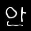

# Handwritten Korean Character Recognition with TensorFlow and Android

Hangul, the Korean alphabet, has 19 consonant and 21 vowel letters.
Combinations of these letters give a total of 11,172 possible Hangul
syllables/characters. However, only a small subset of these are typically used.

This journey will cover the creation process of an Android application that
will utilize a TensorFlow model trained to recognize Korean syllables.
In this application, users will be able to draw a Korean syllable on their
phone, and the application will attempt to infer what the character is by using
the trained model.

The following steps will be covered:
1. Generating image data using free Hangul-supported fonts found online and
   elastic distortion.
2. Converting images to TFRecords format to be used for input and training of
   the model.
3. Training and saving the model.
4. Using the saved model in a simple Android application.


## Prerequisites

Make sure you have the python requirements for this journey installed on you
system. From the root of the repository, run:

```
pip install -r requirements.txt
```


## Generating Image Data

In order to train a decent model, having copious amounts of data is necessary.
However, getting a large enough dataset of actual handwritten Korean characters
is challenging to find and cumbersome to create.

One way to deal with this data issue is to programmatically generate the data
yourself, taking advantage of the abundance of Korean font files found online.
So, that is exactly what we will be doing.

Provided in the tools directory of this repo is
[hangul-image-generator.py](./tools/hangul-image-generator.py).
This script will use fonts found in the fonts directory to create several images
for each character provided
in the given labels file. The default labels file is
[2350-common-hangul.txt](./labels/2350-common-hangul.txt)
which contains 2350 frequent characters derived from the
[KS X 1001 encoding](https://en.wikipedia.org/wiki/KS_X_1001).

The [fonts](./fonts) folder is currently empty, so before you can generate the
Hangul dataset, you must first download
several font files as described in the fonts directory [README](./fonts/README.md).
For my dataset, I used around 22 different font files, but more can always be
used to improve your dataset. Once your fonts directory is populated,
then you can proceed with the actual image generation:

```
./tools/hangul-image-generator.py
```

Optional flags for this are:

* `--label-file` for specifying a different label file (perhaps with less characters).
  Default is ./labels/2350-common-hangul.txt.
* `--font-dir` for specifying a different fonts directory. Default is _./fonts_.
* `--output-dir` for specifying the output directory to store generated images.
  Default is _./image-data_.

Depending on how many labels and fonts there are, this script may take a while
to complete. In order to bolster the dataset, random elastic distortions are also
performed on each generated character image. An example is shown below, with the
original character displayed first, followed by three elastic distortions.





Once the script is done, the output directory will contain a _test-images_ folder
and a _train-images_ folder. This is just a partition to separate training data
from testing data for when we train and test our model. Both of these image folders
will contain several directories corresponding to the labels, and each of these
label directories will contain several 64x64 JPEG images of the parent label.


## Converting Images to TFRecords

The TensorFlow standard input format is TFRecords, so in order to better feed in
data to a TensorFlow Model, let's first create several TFRecords files from our
images. Fortunately, there exists a
[script](https://github.com/tensorflow/models/blob/master/inception/inception/data/build_image_data.py)
that will do this for us in the tensorflow/models repository.

Download that script into the root of the project:

```
curl -O https://raw.githubusercontent.com/tensorflow/models/master/inception/inception/data/build_image_data.py
```

Create an output directory to store the TFRecords files:

```
mkdir ./tfrecords-output
```

Then run the script while specifying the _test-images_ and _train-images_
directories created earlier.

```
python build_image_data.py --train_directory=./image-data/train-images \
    --validation_directory=./image-data/test-images --output_directory=./output \
    --labels_file=./labels/2350-common-hangul.txt --train_shards=6
```

Note: The value for `--train-shards` is the number of files to partition the training
data into. This can be increased or decreased depending on how much data you have.
It is generally just used for splitting up the data so you don't just have one big file.

Once this script has completed, you should have sharded TFRecords files in the
output directory _./tfrecords-output_.

```
$ ls ./tfrecords-output
train-00000-of-00006    train-00003-of-00006    validation-00000-of-00002
train-00001-of-00006    train-00004-of-00006    validation-00001-of-00002
train-00002-of-00006    train-00005-of-00006
```
